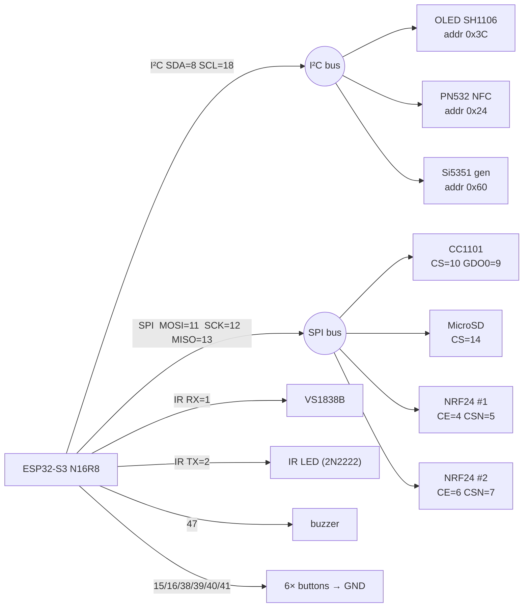

# Build your own — DIY Flipper Zero (ESP32-S3)

A hand-built, Flipper-Zero-class multitool on an **ESP32-S3 N16R8**, running [BruceButBetter](../README.md).
Sub-GHz, NFC/RFID, 2.4 GHz, IR, WiFi/BLE and a signal generator — on a protoboard, for around **$40**.

> One firmware, mixed hardware. Every module is probed at runtime — populate only the chips you
> want; a missing one just shows "not found" and the rest still works. Start with the ESP32-S3 +
> screen + buttons, add radios later.

<!-- TODO: add a photo of YOUR finished build here — this is the single most important image in the repo.
<p align="center"></p>
-->

---

## Cost

| Tier | Parts | Approx. cost |
|---|---|---|
| **Minimum** (usable UI) | ESP32-S3 + OLED + buttons + buzzer | **~$13** |
| **Recommended** (Sub-GHz + NFC + IR) | + CC1101 + PN532 + IR rx/tx + microSD | **~$25** |
| **Full** (everything) | + 2× NRF24 + Si5351 + battery | **~$40** |

Prices are rough AliExpress figures (2026); swap for Amazon/local if you want them faster.

---

## Bill of materials

| # | Part | Spec / notes | ~$ | Where |
|--:|------|--------------|---:|-------|
| 1 | **ESP32-S3 DevKitC-1** | **N16R8** (16 MB flash, 8 MB PSRAM), dual USB-C | 7.00 | [search](https://www.aliexpress.com/wholesale?SearchText=ESP32-S3+DevKitC-1+N16R8) |
| 2 | OLED 1.3" | **SH1106** driver (a.k.a. SSD1106G), I²C, 128×64 | 3.50 | [search](https://www.aliexpress.com/wholesale?SearchText=1.3+inch+OLED+SH1106+I2C) |
| 3 | CC1101 module | Sub-GHz 300–928 MHz, SPI | 2.50 | [search](https://www.aliexpress.com/wholesale?SearchText=CC1101+module+868) |
| 4 | PN532 module | NFC 13.56 MHz, set to **I²C** mode | 4.00 | [search](https://www.aliexpress.com/wholesale?SearchText=PN532+NFC+module) |
| 5 | NRF24L01+ ×2 | 2.4 GHz; PA/LNA versions reach further | 3.00 | [search](https://www.aliexpress.com/wholesale?SearchText=NRF24L01+module) |
| 6 | Si5351 module | clock/signal gen 8 kHz–160 MHz, I²C | 3.00 | [search](https://www.aliexpress.com/wholesale?SearchText=Si5351+module) |
| 7 | MicroSD module | SPI card reader | 1.00 | [search](https://www.aliexpress.com/wholesale?SearchText=micro+sd+card+module+spi) |
| 8 | VS1838B | IR receiver 38 kHz | 0.30 | [search](https://www.aliexpress.com/wholesale?SearchText=VS1838B+IR+receiver) |
| 9 | IR LED + 2N2222 + 220Ω | IR transmitter (transistor-driven) | 0.50 | [search](https://www.aliexpress.com/wholesale?SearchText=940nm+IR+LED+2N2222) |
| 10 | Passive buzzer | tone output | 0.30 | [search](https://www.aliexpress.com/wholesale?SearchText=passive+buzzer+module) |
| 11 | Tactile buttons ×6 | 6×6 mm through-hole | 0.50 | [search](https://www.aliexpress.com/wholesale?SearchText=6x6+tactile+button) |
| 12 | Protoboard + jumpers | perfboard or breadboard + dupont wire | 3.00 | [search](https://www.aliexpress.com/wholesale?SearchText=perfboard+kit+jumper+wires) |
| 13 | *(optional)* LiPo + TP4056 | battery + charger for portable use | 4.00 | [search](https://www.aliexpress.com/wholesale?SearchText=18650+lipo+tp4056) |

> ⚠️ **PN532 must be in I²C mode** (set the two DIP switches / solder jumpers per its silkscreen),
> not SPI/HSU. CC1101 frequency band: pick the one legal/usable in your region (433 / 868 / 915).

---

## Wiring

Two shared buses do most of the work. The I²C devices and SPI devices each share their bus lines;
only the chip-select / control pins are unique, so there are no conflicts.



### Full pin table

| ESP32-S3 pin | Goes to | Bus / role |
|---|---|---|
| IO8 | OLED + PN532 + Si5351 SDA | I²C data (shared) |
| IO18 | OLED + PN532 + Si5351 SCL | I²C clock (shared) |
| IO11 | CC1101 + SD + NRF24×2 | SPI MOSI (shared) |
| IO12 | CC1101 + SD + NRF24×2 | SPI SCK (shared) |
| IO13 | CC1101 + SD + NRF24×2 | SPI MISO (shared) |
| IO10 | CC1101 | CS |
| IO9  | CC1101 | GDO0 |
| IO14 | MicroSD | CS |
| IO4 / IO5 | NRF24 #1 | CE / CSN |
| IO6 / IO7 | NRF24 #2 | CE / CSN |
| IO1 | VS1838B | IR receive |
| IO2 | IR LED (via 2N2222 base + 220Ω) | IR transmit |
| IO47 | passive buzzer | tone |
| IO15 / IO16 / IO38 / IO39 / IO40 / IO41 | buttons → GND | UP / DOWN / LEFT / RIGHT / OK / BACK |
| 3V3 / GND | every module's VCC / GND | power rails |

### ⛔ Reserved GPIO — never wire these (bricks the board)

```
GPIO 26–32  → QSPI flash
GPIO 33–37  → OPI PSRAM (forbidden on N16R8)
GPIO 19–20  → native USB D+/D− (kept free for Bad USB / HID)
GPIO 45–46  → strapping pins
GPIO 43–44  → UART0 TX/RX (programming/debug)
```

---

## Assembly

1. **Power rails first.** Run a 3V3 rail and a GND rail down the protoboard. Every module's VCC →
   3V3, GND → GND. The ESP32-S3 supplies 3V3 from USB; for many radios at once a small battery +
   TP4056 is steadier.
2. **Screen + buttons.** Wire the OLED (I²C) and the six buttons (each pin → button → GND; internal
   pull-ups are enabled in firmware). Flash now and confirm the UI before adding radios — easiest to
   debug with the least soldered.
3. **I²C devices.** Add PN532 and Si5351 onto the same SDA/SCL. They have distinct addresses
   (`0x3C` / `0x24` / `0x60`) so they coexist. **PN532 in I²C mode.**
4. **SPI devices.** Add CC1101, the microSD reader, then the two NRF24 modules — all sharing
   MOSI/SCK/MISO, each with its own CS/CSN. Keep SPI jumpers short; long breadboard wires cause
   flaky reads.
5. **IR + buzzer.** VS1838B OUT → IO1. IR LED through a 2N2222 (base via 220Ω from IO2, LED on the
   collector side) so the GPIO isn't driving the LED directly.
6. **NRF24 decoupling.** Each NRF24L01+ wants a 10 µF cap across VCC/GND right at the module, or it
   browns out during TX. PA/LNA versions especially.

---

## Flash it

**Easiest — browser flasher** (Chrome/Edge, connect the **left** USB-C):

➡️ **https://Yoursel71.github.io/BruceButBetter/**

**Or esptool:**

```sh
esptool.py --chip esp32s3 --port COMx write_flash 0x0 Bruce-esp32-s3-devkitc-1-psram.bin
```

Grab `Bruce-esp32-s3-devkitc-1-psram.bin` from the
[latest release](https://github.com/Yoursel71/BruceButBetter/releases/latest).

---

## First boot / verify

- Screen shows the BruceButBetter boot logo → the menu.
- **Run Hardware Self-Test first** (top-level menu): it probes the I²C and SPI buses and lists what
  answered — OLED, PN532, Si5351, microSD and both NRF24 radios with `[OK]`/`[--]`. The fastest way to
  confirm your wiring/soldering before touching the feature menus.
- Open each module's menu; a populated chip is detected, a missing one says "not found" (expected).
- microSD: format **FAT32**; firmware auto-creates its folders on first run.
- Bad USB / HID uses the **right** USB-C (native USB); programming/serial uses the **left**.

## Troubleshooting

| Symptom | Likely cause |
|---|---|
| Won't flash / no port | use the **left** USB-C; install CH34x/USB-JTAG driver; hold BOOT while plugging |
| Boot loop | wired into a reserved GPIO (see list); pulled a strapping pin (45/46) at boot |
| OLED blank | wrong driver (must be **SH1106**, not SSD1306); SDA/SCL swapped; address not `0x3C` |
| PN532 not found | left in SPI/HSU mode — switch it to **I²C** |
| NRF24 resets on TX | missing 10 µF cap at the module; weak USB 3V3 → use a battery |
| CC1101 silent | wrong region band; GDO0 not on IO9; CS not on IO10 |

---

Built one? Open a PR adding your photo to `docs/img/` and a line to the README — reproducible builds
are what this project is for.
